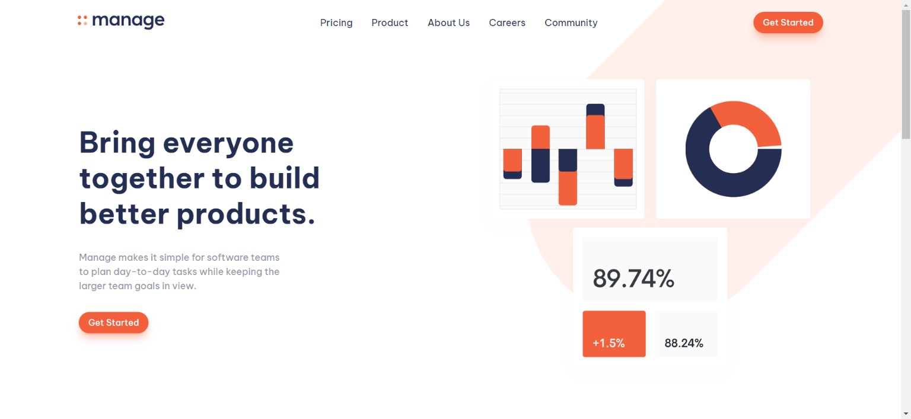

# Manage - Modern Web Page

Welcome to **Manage**, my latest project crafted with passion and technology! 🚀 This modern web page is built using ReactJS, Tailwind CSS, Framer Motion, React Hook Form, and React Hot Toast, thanks to the wonderful resources from Frontend Mentor.

## Features

- **Sleek Design:** Enjoy a visually appealing layout with modern aesthetics.
- **Seamless Interactivity:** Experience a smooth user interface powered by ReactJS.
- **Real-Time Validation:** Implemented React Hook Form for efficient and real-time form validation.
- **Instant Feedback:** Utilized React Hot Toast for immediate user feedback, enhancing user experience.
- **Responsive UI:** Fully responsive design ensures a seamless experience across all devices.

## Technologies Used

- ReactJS
- Tailwind CSS
- Framer Motion
- React Hook Form
- React Hot Toast

## How to Contribute

1. **Fork** the repository.
2. Clone your fork: `git clone https://github.com/KamalJoshi-web/manage.git`
3. Create a new branch: `git checkout -b feature/new-feature`
4. Commit your changes: `git commit -m 'Add a new feature'`
5. Push to the branch: `git push origin feature/new-feature`
6. Submit a pull request!

Let's make **Manage** even better together! Feel free to connect with me for any suggestions or feedback. Happy coding! 🌟

**#ReactJS #WebDevelopment #FrontendDev #OpenSource**

---

_Note: This project was completed as part of the Frontend Mentor challenges, aimed at enhancing frontend development skills._
